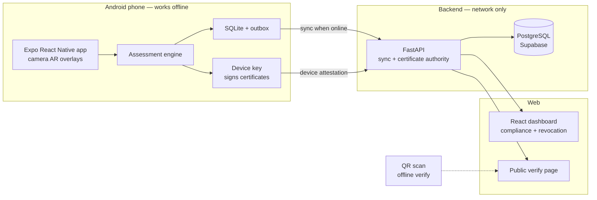

# Suraksha Saathi

**AR-based vocational safety training and certification for Jharkhand's mining, steel and mica workers.**

Smart India Hackathon 2026 · PS 26041 · Team Caffeine Coders

<p>
  
  
  
  
  
</p>

> **Status:** active prototype. `docs/00-PRD.md` defines scope and acceptance criteria; `docs/TASKS.md` is the live task board.

> **Note on the stack:** the app was originally prototyped in Unity. It is now built with **Expo React Native** using camera-based AR overlays (decision `D-027`). This cut the build loop from minutes to seconds, removed the Unity Hub / Android NDK setup burden for the whole team, and let us ship over-the-air through **Expo Go** instead of passing APKs around. Parts of `docs/00`–`09` still describe the Unity app; where they disagree with `mobile/CLAUDE.md`, `mobile/CLAUDE.md` and `D-027` win. Data contracts — scenario JSON, events, scoring, tokens, API, DB — are unchanged by the switch.

---

## The problem

Safety training for industrial workers in Jharkhand is mostly classroom lectures and multiple-choice tests. A worker can pass a written quiz on fire response and still freeze at a real LPG leak. Training also assumes literacy, a steady internet connection, and a trainer in the room — none of which hold on a mine or mill floor.

## What Suraksha Saathi does

- **AR safety drills on the real floor.** Hazards are overlaid on the worker's actual surroundings through the phone camera. No headset, no VR lab — a mid-range Android phone is enough.
- **Two complete modules.** Fire & Explosion (`FIRE_01`) and Gas Leak & Confined Space (`GAS_01`).
- **Scores what the worker *does*, not what they can recall.** The assessment engine grades actions, timing and sequence. Critical mistakes fail the attempt outright.
- **Issues a signed QR certificate.** Signed on the device with a root-attested device key, so a certificate can be issued *and* verified with zero network access — an inspector at a pit head can scan and trust it offline.
- **Hindi and Santali, voice-first.** Every string goes through localisation; audio narration carries workers with low literacy.
- **Fully offline.** Everything the worker does works in airplane mode. The network is only ever used to sync.
- **Web compliance dashboard.** Site-wise compliance, recertification tracking and certificate revocation for supervisors and inspectors.

## How it maps to the problem statement

| PS expected solution | Where it lives |
| --- | --- |
| Android APK, Android 10+, mid-range phone, no headset | `mobile/` |
| ≥ 2 complete AR modules (`FIRE_01`, `GAS_01`) | `mobile/`, `content/scenarios/` |
| Assessment engine | `mobile/` — rules in `docs/03-ASSESSMENT-ENGINE.md` |
| QR certificate generation **and** verification | `mobile/`, `backend/`, public verify page in `dashboard/` |
| Hindi + Santali localisation | `mobile/`, strings in `content/` |
| Offline functionality | SQLite + outbox sync in `mobile/` |
| Web admin compliance dashboard | `dashboard/` |
| Demo video + public repo | `docs/09-DEMO-SCRIPT.md` |

---

## Architecture



The app is offline-first: drills, scoring and certificate issuance never touch the network. A local SQLite database with an outbox queue holds attempts and events until a connection is available, at which point FastAPI reconciles them. Certificates are signed on-device with a key attested by a root signing key, so verification only needs the root public key — which ships with the app and lives in `content/trust/root_public_key.txt`.

Full detail: `docs/01-ARCHITECTURE.md` and `docs/05-DATA-AND-SYNC.md`.

## Repo map

| Path | What |
| --- | --- |
| `mobile/` | Expo React Native Android app — AR, assessment, offline store, certificates |
| `backend/` | FastAPI sync service + certificate authority (PostgreSQL / Supabase) |
| `dashboard/` | React + Vite + TypeScript admin dashboard and public verify page |
| `content/scenarios/` | Scenario JSON — the single source of truth for module steps, thresholds and PPE |
| `content/trust/` | Root public key and trust anchors |
| `docs/` | Specifications; source of truth for behaviour and data contracts |

---

## Getting started

### Prerequisites

| For | You need |
| --- | --- |
| `mobile/` | Node.js 20+, an Android phone, [Expo Go](https://expo.dev/go) for everyday work — plus USB debugging and a dev build for AR |
| `backend/` | Python 3.12, [`uv`](https://docs.astral.sh/uv/) |
| `dashboard/` | Node.js 20+ |

AR features need a device on [Google's ARCore supported list](https://developers.google.com/ar/devices). Keep one non-ARCore phone around to test the fallback path.

### Clone

Fonts, audio and images are stored in **Git LFS**. Without it you get small pointer files instead of real assets.

```bash
git lfs install          # once per machine, before cloning
git clone https://github.com/buildwithpriince/suraksha-saathi.git
cd suraksha-saathi
git lfs pull             # only if you cloned before installing Git LFS
```

In `git lfs ls-files`, a `*` means a real file and a `-` means an unresolved pointer.

Line endings are normalised to LF by `.gitattributes` on every OS. Don't change `core.autocrlf`; a "CRLF will be replaced by LF" warning is that working as intended.

### Run the app

Install **[Expo Go](https://expo.dev/go)** from the Play Store on your phone, then:

```bash
cd mobile
npm install
npx expo start
```

Scan the QR code in the terminal with Expo Go and the app loads on your phone — no cable, no APK, no Android Studio. Phone and laptop need to be on the same network. Saving a file hot-reloads the app on the device.

Expo Go is the fastest way to work on screens, scoring, localisation and the offline store. It can't load custom native modules, so the camera AR path needs a development build instead:

```bash
npx expo run:android          # builds and installs a dev client over USB
```

After that, `npx expo start --dev-client` gives you the same instant-reload loop with native AR available.

> `mobile/android/` and `mobile/ios/` are generated by `expo prebuild` and must never be edited by hand. Native configuration goes in `mobile/app.config.ts` or a config plugin.

### Run the backend

```bash
cd backend
uv sync
cp .env.example .env     # fill in the values below
uv run fastapi dev app/main.py
```

### Run the dashboard

```bash
cd dashboard
npm install
npm run dev
```

## Environment

Never commit `.env*`, `*.pem` or anything under `keys/`. The root signing private key exists only in the backend environment.

**`backend/.env`** (template in `backend/.env.example`)

| Variable | Purpose |
| --- | --- |
| `DATABASE_URL` | PostgreSQL connection string (Supabase session pooler, `?sslmode=require`) |
| `SUPABASE_URL` | Supabase project URL |
| `SUPABASE_JWKS_URL` | `<SUPABASE_URL>/auth/v1/.well-known/jwks.json` |
| `ROOT_SIGNING_KEY_B64` | Root signing private key — generated once, stored only in the deploy environment |
| `CORS_ORIGINS` | Allowed dashboard origins |

**`dashboard/.env.local`**

| Variable | Purpose |
| --- | --- |
| `VITE_API_BASE_URL` | Backend base URL |
| `VITE_SUPABASE_URL` | Supabase project URL |
| `VITE_SUPABASE_ANON_KEY` | Supabase anon key |

Generate the root key once with `uv run python -m app.tools.gen_root_key`. Commit only the resulting public key to `content/trust/root_public_key.txt`.

## Tests

```bash
cd mobile     && npm test && npm run typecheck && npm run lint
cd backend    && uv run pytest -q
cd dashboard  && npm run typecheck && npm run test && npm run build
```

Validate scenario content against the schema:

```bash
cd backend && uv run python -m app.tools.validate_scenarios ../content/scenarios
```

---

## Deployment

**Backend — Render.** Dashboard → New → Blueprint → this repo (`render.yaml` sits at the root). Fill in `DATABASE_URL`, `ROOT_SIGNING_KEY_B64`, `SUPABASE_URL`, `SUPABASE_JWKS_URL` and `CORS_ORIGINS`. Set `SEED_DEMO_ON_START=true` on the first deploy for the demo database — the seed refuses to run twice, so it's safe to leave on. Every start runs `alembic upgrade head`.

Check the deploy:

```
GET /v1/health            -> {"status":"ok"}
GET /v1/content/manifest
GET /v1/revocations
```

The free Render plan sleeps when idle — hit `/v1/health` a minute before any demo.

**Dashboard — Vercel**, configured by `vercel.json` and `.vercelignore`.

**Dashboard admins.** Create a user in Supabase Auth, then grant them access:

```sql
insert into admin_profiles (user_id, role, site_ids)
values ('<uid>', 'admin', '{}');
```

Or locally: `uv run python -m app.tools.seed_demo --admin <uid>`.

---

## Documentation

| Area | Spec |
| --- | --- |
| Scope, acceptance criteria | `docs/00-PRD.md` |
| System design, offline model | `docs/01-ARCHITECTURE.md` |
| AR module flows | `docs/02-AR-MODULES.md` |
| Scoring rules | `docs/03-ASSESSMENT-ENGINE.md` |
| QR certificate format + crypto | `docs/04-CERTIFICATES.md` |
| Local DB, server DB, sync | `docs/05-DATA-AND-SYNC.md` |
| REST API | `docs/06-API.md` |
| Hindi/Santali, fonts, audio | `docs/07-LOCALIZATION.md` |
| Dashboard screens | `docs/08-DASHBOARD.md` |
| Demo video storyboard | `docs/09-DEMO-SCRIPT.md` |
| Task board | `docs/TASKS.md` |
| Decisions log | `docs/DECISIONS.md` |

Team workflow, tooling and secrets handling: `SETUP.md`. Working conventions for AI-assisted development: `CLAUDE.md`.

## Contributing

- One task from `docs/TASKS.md` at a time; branch per task (`t-22-scenario-player`), small PRs, merge daily.
- Commits read `T-XX: short imperative summary`.
- Specs win over assumptions. If code and spec disagree, fix the spec in the same change — and update every consumer of a changed data contract (scenario JSON, QR format, API shape, DB schema).
- Safety content — steps, thresholds, PPE — only ever comes from `content/scenarios/*.json`. Never invent safety facts in code or strings; mark unknowns `"needsReview": true`.
- All user-facing text goes through localisation keys. No hard-coded strings in the UI.
- Anything a worker does must work in airplane mode.

## Roadmap

- Remaining PS safety domains, starting with Machinery
- Hardware-backed keys (StrongBox / TEE attestation)
- DigiLocker integration for certificate portability

## Demo

- Video: _coming soon_
- Screenshots: _coming soon_

## Credits

Third-party 3D models, VFX, fonts and sounds are listed here with their licenses as they are imported.

## License

To be chosen.

## Team

**Caffeine Coders** — Smart India Hackathon 2026.
