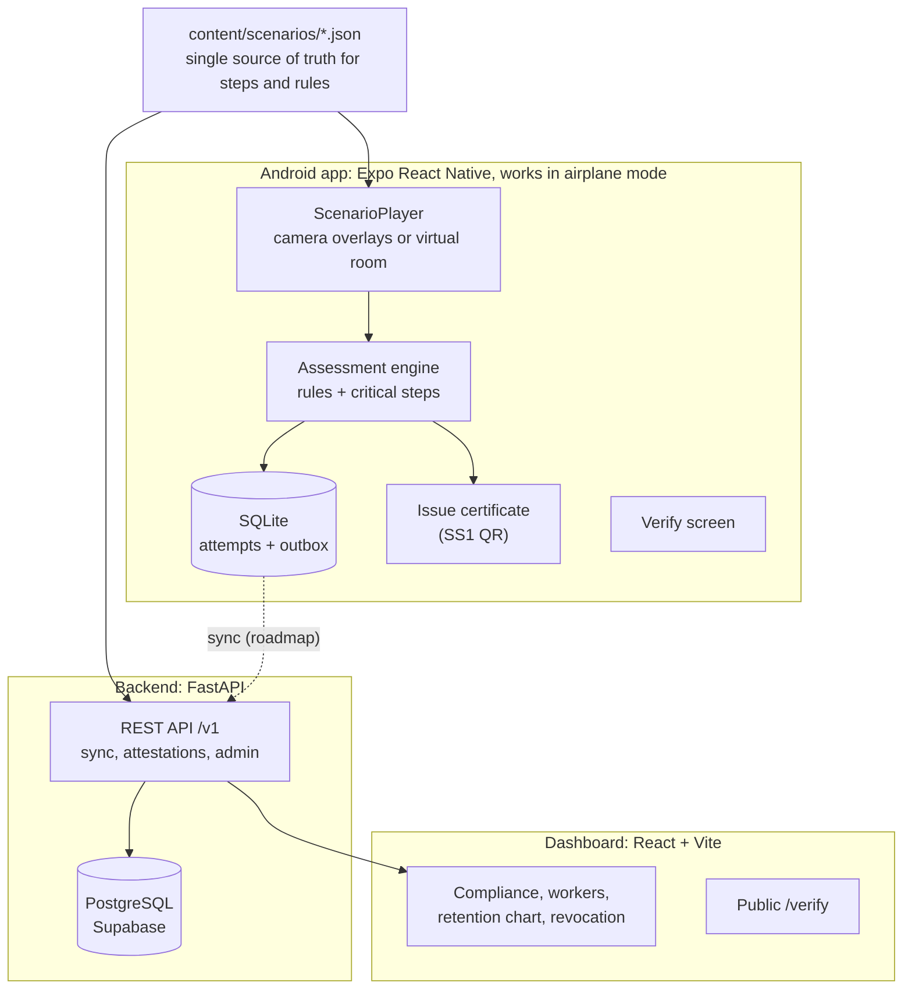
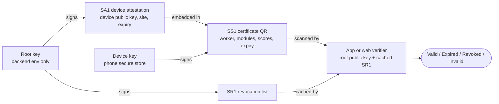

# Suraksha Saathi

**Camera-based safety drills for new industrial workers in Jharkhand: learn by doing, get a certificate anyone can verify offline.**

[](https://github.com/buildwithpriince/suraksha-saathi/actions/workflows/ci.yml)
[](LICENSE)
[](#download-the-apk)

Smart India Hackathon 2026 · PS 26041 (Govt. of Jharkhand) · Team Caffeine Coders

## The problem

- DGMS recorded **48 fatal mine accidents in Jharkhand in 2022-23**, many involving workers with under 30 days of orientation.
- Classroom training from static manuals keeps **under 20%** of what was taught after one week.
- Live drills stop production, VR headsets are out of reach for small mines and contractors, and paper certificates can't prove a worker understood anything.

## What it does

| | |
|---|---|
| **Two complete drills** | `FIRE_01` Fire & explosion and `GAS_01` Gas leak & confined space, drawn over the live camera on the worker's real floor. No camera or permission denied? The same drills run in a drawn virtual room. |
| **PASS extinguisher technique** | Pull the pin (drag it out), Aim at the base, Squeeze the lever, Sweep side to side, with a fire that grows, shrinks or flares up depending on what you do. |
| **Action-based scoring** | Scores what the worker *does* (order, timing, aim, choices), not quiz answers. 9 rules per module, 70% to pass; missing a critical step (3 in fire, 4 in gas) fails the attempt whatever the score. The result screen explains every lost point, out loud. |
| **Offline certificates** | Passing the required modules issues a signed QR certificate on the phone, with no network. A two-level Ed25519 chain (root → device attestation → certificate) lets the app or the web verifier check it offline. |
| **Refresher drills** | Short re-runs of the critical steps fall due on day 7 and day 30 after the first pass, to fight the forgetting curve. |
| **Wallet cards** | Bank-card-size worker ID card (QR opens the worker's training on a shared phone) and certificate card, shareable as an image or printable. |
| **Hindi and Santali** | Every screen and instruction in English, Hindi and Santali (Ol Chiki script), switchable at runtime, with spoken instructions. |
| **Compliance dashboard** | Web dashboard for supervisors and admins: sites, workers, attempts, certificates, compliance heatmap, recertification due, revocation, CSV export and a refresher retention chart. |

## Download the APK

**[Download the latest APK from GitHub Releases](https://github.com/buildwithpriince/suraksha-saathi/releases/latest)** (`suraksha-saathi-v1.0.0.apk`, Android 10 or newer, no headset or ARCore needed).

1. Open the link on the phone and download the `.apk`.
2. When Android asks, allow your browser or file manager to **install unknown apps**.
3. Open the APK and tap **Install**. If Play Protect warns about an unrecognised app, choose **More details → Install anyway** (the app is not on the Play Store).
4. Print the exit markers from [`mobile/assets/markers/`](mobile/assets/markers/) for the evacuation step (optional: without them, use the drawn exit).

## Screenshots

<table>
  <tr>
    <td align="center"><br><sub>Home: workers, refresher badges, language</sub></td>
    <td align="center"><br><sub>FIRE_01 on the real floor</sub></td>
    <td align="center"><br><sub>PASS: pull, aim, squeeze, sweep</sub></td>
  </tr>
  <tr>
    <td align="center"><br><sub>Result: every lost point explained</sub></td>
    <td align="center"><br><sub>Signed QR certificate, issued offline</sub></td>
    <td align="center"><br><sub>Offline verification</sub></td>
  </tr>
  <tr>
    <td align="center"><br><sub>Worker ID wallet card</sub></td>
    <td align="center"><br><sub>Dashboard: compliance overview</sub></td>
    <td align="center"><br><sub>Refresher retention chart</sub></td>
  </tr>
</table>

## Architecture



**Certificate trust chain** (Ed25519, [docs/04](docs/04-CERTIFICATES.md)):



The phone only needs the root **public** key and a cached revocation list to decide Valid / Expired / Revoked / Invalid, so an inspector at a site gate gets an answer with no network. Details: [docs/01-ARCHITECTURE.md](docs/01-ARCHITECTURE.md), [docs/04-CERTIFICATES.md](docs/04-CERTIFICATES.md).

## Tech stack

| Part | Stack |
|---|---|
| Android app (`mobile/`) | Expo SDK 57, React Native (New Architecture, Hermes), TypeScript, expo-router, expo-camera, expo-sensors, Reanimated, react-native-svg, Lottie, expo-sqlite, expo-secure-store, @noble/ed25519, i18next, expo-speech, Vitest |
| Backend (`backend/`) | Python 3.12, FastAPI, SQLAlchemy 2 (async), Alembic, PostgreSQL (Supabase), cryptography (Ed25519), PyJWT, uv, pytest, ruff; deployed with a Render Blueprint |
| Dashboard (`dashboard/`) | React 18, Vite, TypeScript, Tailwind CSS 4, TanStack Query, React Router, Recharts, Supabase Auth, @zxing/browser, Vitest; deployed on Vercel |
| Content (`content/`) | Scenario JSON (steps, rules, safety content), string tables (CSV), trust keys and shared test vectors |

## Quick start

Prerequisites: Git with Git LFS, Node.js 22.13+ (24 LTS recommended), Python 3.12 and [uv](https://docs.astral.sh/uv/). Team setup and deployment: [SETUP.md](SETUP.md).

```bash
git lfs install
git clone https://github.com/buildwithpriince/suraksha-saathi.git
cd suraksha-saathi
```

**Android app** (run on a phone with [Expo Go](https://expo.dev/go), same Wi-Fi):

```bash
cd mobile
npm install
npx expo start
```

**Backend** (local SQLite database, no Docker needed):

```bash
cd backend
uv sync
cp .env.example .env    # then set DATABASE_URL=sqlite:///./local.db
uv run python -m app.tools.gen_root_key --public-key-file local_root_public_key.txt
# put the printed ROOT_SIGNING_KEY_B64 in .env (gitignored; never commit it)
uv run alembic upgrade head
uv run python -m app.tools.seed_demo
uv run fastapi dev app/main.py    # http://127.0.0.1:8000/v1/health
```

`--public-key-file` keeps a throwaway local key out of `content/trust/`. For a real deployment, follow [SETUP.md section 8](SETUP.md#8-deploy-the-backend-to-render-human-once-task-t-58).

**Dashboard** (runs on built-in demo data unless the `VITE_*` variables in `dashboard/.env.example` are set):

```bash
cd dashboard
npm install
npm run dev    # http://localhost:5173; the login page lists the demo accounts
```

## Testing

| Part | Tests | Commands |
|---|---|---|
| Android app | 330 tests in 26 files (scoring, crypto vectors, scenario contract, player, SQLite schema and outbox, l10n) | `cd mobile && npm test && npm run typecheck` |
| Backend | 371 tests | `cd backend && uv run pytest -q && uv run ruff check . && uv run ruff format --check .` |
| Dashboard | 78 tests in 7 files | `cd dashboard && npm run typecheck && npm run test && npm run build` |

All three run in [CI](.github/workflows/ci.yml) on every push and pull request. The same Ed25519 test vectors ([content/trust/test-vectors.json](content/trust/test-vectors.json), TEST keys only) are checked by the app, backend and dashboard, so all three agree byte for byte on what a valid certificate is.

## Built vs roadmap

| Built and working in the APK / dashboard | Roadmap |
|---|---|
| FIRE_01 and GAS_01, camera mode and virtual-room fallback | Remaining PS safety domains (machinery and the rest) as new scenario JSON |
| Orientation-anchored overlays (3DoF gyro filter), printed QR exit markers, marker lock | True ARCore plane and position tracking (today overlays hold direction but not position) |
| Action-based scoring with critical failures, result explanations | Phone-to-backend sync client (the backend sync API and outbox are built; the app does not send yet) |
| Offline certificate issue and verify, two-level Ed25519 chain, revocation list | Real root key ceremony: the demo build signs with the published TEST keys and says so on screen |
| Refresher drills at day 7 and 30, retention chart | Native-reviewed Santali and recorded Santali narration |
| Worker ID and certificate wallet cards, printable ID sheet | Kiosk QR login (locked worker session, language switch at login); today the ID card QR opens the worker's page |
| English, Hindi, Santali (Ol Chiki) UI with spoken instructions | Recorded narration in place of text-to-speech |
| Compliance dashboard, public verify page | |

Being honest about the demo:

- **The dashboard demo runs on seeded data**: either its built-in mock (no backend) or a backend filled by `seed_demo` (3 sites, 40 workers, 148 attempts). Phones do not sync to it yet.
- **Santali strings are machine drafts under native-speaker review.** All 336 are marked `needsReview`; the app says so on the Home screen, and Santali narration is spoken with the Hindi voice. A speaker can correct them in one spreadsheet ([docs/07](docs/07-LOCALIZATION.md#translation-workflow)).
- **Certificates in the demo are signed with TEST keys**, flagged by a "Demo keys" banner in the app.

## Key design decisions

Full log with alternatives rejected: [docs/DECISIONS.md](docs/DECISIONS.md).

- **Unity → Expo React Native ([D-027](docs/DECISIONS.md)).** Unity's Android build support would not install on the lead's machine and blocked every app task. Expo gave camera overlays that run on any Android 10+ phone (no ARCore device list), cloud APK builds without a local Android SDK, native Devanagari rendering, and TypeScript shared with the dashboard. The cost is no world tracking, which printed QR markers and marker lock partly make up for.
- **Scenario steps are data ([D-003](docs/DECISIONS.md)).** One generic ScenarioPlayer plays any module from JSON, so safety experts can review content without reading code and new domains need no new app logic.
- **Two-level signature chain ([D-005](docs/DECISIONS.md)).** Root key → device attestation → certificate lets a phone issue *and* a stranger verify a certificate with no network. Blockchain was rejected as unnecessary.
- **Compact signed tokens, verified over the transmitted bytes ([D-006](docs/DECISIONS.md)).** No JSON canonicalisation, so the TypeScript and Python verifiers can't disagree.
- **Santali in Ol Chiki, labelled honestly ([D-047](docs/DECISIONS.md)).** The script the community reads Santali in, with uncertain safety terms left in English rather than invented, and a one-command review loop for native speakers.

## Repo map

| Path | What |
|---|---|
| [`mobile/`](mobile/) | Android app (Expo) |
| [`backend/`](backend/) | FastAPI API, database models, Alembic migrations, demo seed |
| [`dashboard/`](dashboard/) | React admin dashboard and public verify page |
| [`content/`](content/) | Scenario JSON, string tables, trust keys and test vectors |
| [`docs/`](docs/) | Specs 00–09, task board, decisions log |

## Team

Team Caffeine Coders

| Name | Role |
|---|---|
| _Name_ | _Team lead, architecture and app core_ |
| _Name_ | _Camera interactions and ScenarioPlayer_ |
| _Name_ | _App screens and localisation_ |
| _Name_ | _Backend and deployment_ |
| _Name_ | _Dashboard_ |
| _Name_ | _Safety content, strings, device QA and demo_ |

## License

[MIT](LICENSE) © 2026 Team Caffeine Coders. Fonts: Noto Sans Devanagari and Noto Sans Ol Chiki, SIL Open Font License 1.1.
